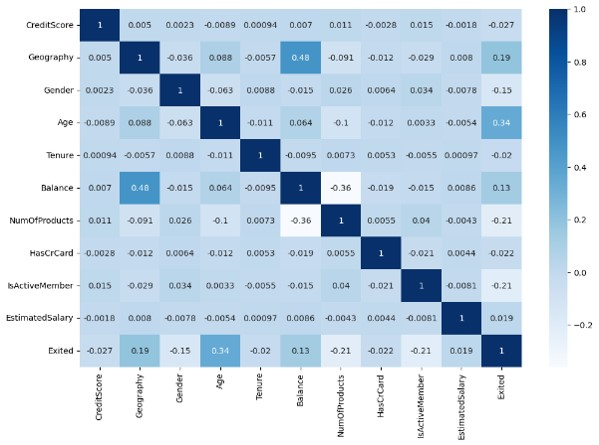
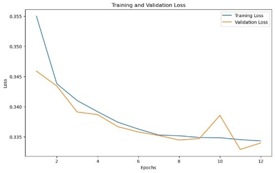
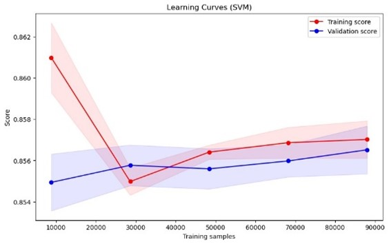

# Predicting Bank Customer Churn
## Project Overview
Customer churn analysis is crucial for banks aiming to maintain profitability, enhance customer satisfaction, and remain competitive. By accurately identifying customers at risk of leaving, banks can take proactive steps to improve retention and strengthen customer relationships. This project focuses on developing a supervised classification model for predicting customer churn using two machine learning approaches: Multilayer Perceptrons (MLP) and Support Vector Machines (SVM). The experiment compares the performance of these two models to determine which is better suited for predicting churn based on customer data. By evaluating model accuracy and classification effectiveness, we gain insights into the strengths and characteristics of each algorithm in handling churn prediction. Ultimately, the best-performing model will enable banks to anticipate future churn trends, helping them take timely actions to retain valuable customers and improve overall service quality.

## Project Files
- **Data**: Test sets are stored in the `data`. The raw data is in the `data/raw`.
- **Notebooks**: The notebook for training and testing is located in the `notebooks/` folder.
- **Models**: The created models are located in the `models/` folder.
- **Results**: Visualisations, such as training loss or ROC curve of the models, can be found in the `results/figures` folder.

## Methodology 
- **Data Preprocessing**: Class imbalance is handled using repeated stratified K-fold cross-validation. Consider oversampling/undersampling. Apply data scaling and normalisation. Analyse the correlation between all features and the target.

  ***Correlation between all features and the target***
    
  
  
- **Modeling**:
    - For ***Multilayer Perceptron (MLP)***: Data converted to PyTorch tensors. Two hidden layers optimized via grid search on hyperparameters (learning rate, hidden units, weight decay, epochs).
  
      ***Loss plots of the MLP model***
    
      

    - For ***Support Vector Machine (SVM)***: RBF kernel applied. Grid search on regularization parameter C and gamma, optimized with halving grid search.

      ***Learning curves of the SVM model***
    
      
      
- **Evaluation**: Best configurations evaluated based on accuracy, ROC, and Precision-Recall curves.

## Key Findings
- **Model Performance**:
  - ***Multilayer Perceptron (MLP)***: Faster training time and higher accuracy than SVM.
  - ***Support Vector Machine (SVM)***: Slower training due to larger dataset size. Performance impacted by data imbalance despite cross-validation.

  ***Model comparison using the test set***
  
  | Model Name | Accuracy | AUC | Average Precision score | Training & Validation Time (sec) using CPU |
  | --- | --- | --- | --- | --- |
  | MLP Model | 86.32 | 0.89 | 0.72 | 263.23 |
  | SVM Model | 85.73 | 0.84 | 0.68 | 1352.12 |

- **Interpretability**: SVM provides more interpretable decision boundaries, useful for business contexts. MLP outperforms in speed and accuracy but is harder to interpret.

## Future Work
- **Overfitting Prevention**: Use EarlyStopping for MLP to automatically limit epochs.
- **SVM Improvements**: Further investigate iteration impact on accuracy. Experiment with additional class weights to address imbalance.
- **Ensemble Approach**: Combine MLP’s feature extraction with SVM’s classification in ensemble models for similar classification tasks.

## Used Datasets
- [**Binary Classification with a Bank Churn Dataset**](https://www.kaggle.com/competitions/playground-series-s4e1)
